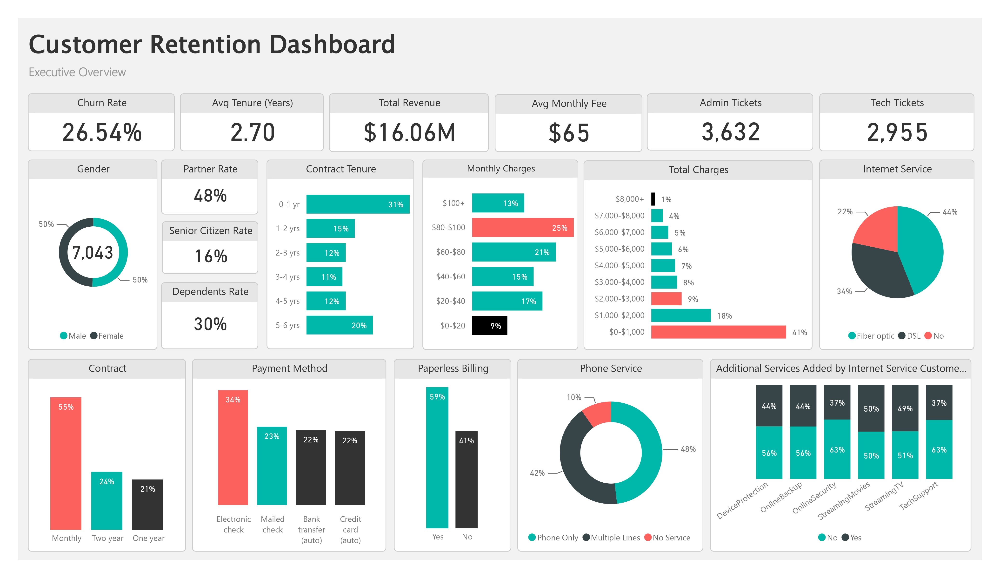
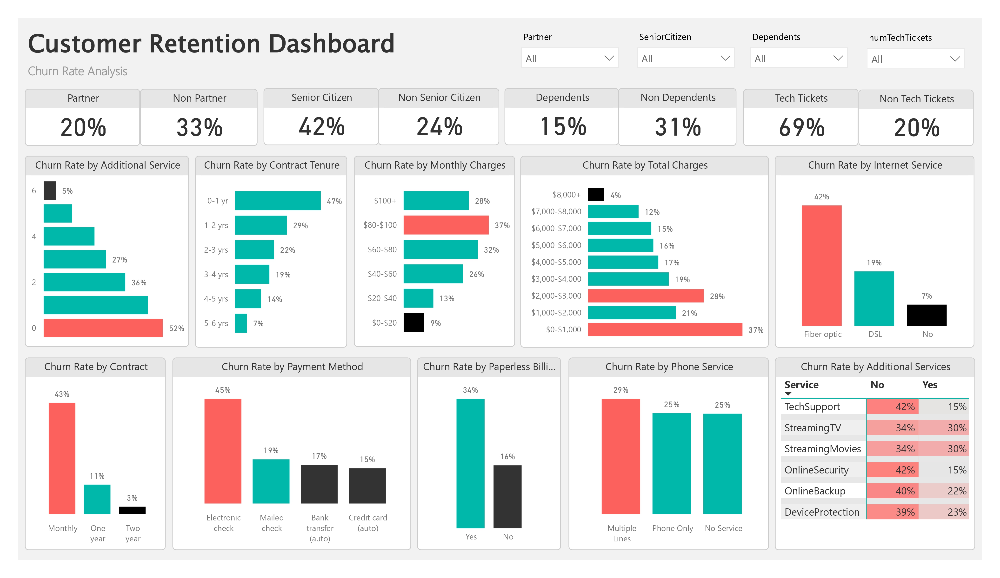
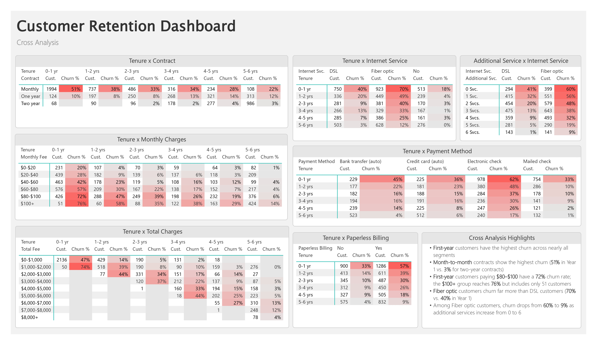

# 📊 Customer Retention Dashboard

An interactive Power BI dashboard that analyzes customer churn behavior and identifies the key factors associated with customer churn.

---

# 📖 Project Overview

Customer churn is a critical business challenge that directly impacts revenue and customer lifetime value. This project explores the Telco Customer Churn dataset using Power BI to uncover the characteristics of customers who are most likely to leave.

The dashboard combines descriptive analysis with cross-analysis to identify relationships between customer tenure, contract type, monthly charges, internet service, payment methods, and additional services.

---

# 📊 Dashboard Preview

## Executive Overview

---

## Churn Rate Analysis

---

## Cross Analysis

---

# 🔍 Key Findings

- Customers in their **first year** consistently exhibit the highest churn rates.
- **Month-to-month contracts** have the highest churn, reaching **51%** in the first year and remaining **22%** after 5–6 years.
- Among first-year customers, those paying **$80–$100/month** have a **72%** churn rate. Although the **$100+** group reaches **76%**, it represents only **51 customers**.
- **Fiber optic** customers experience substantially higher churn than **DSL** customers (**70% vs. 40%** in the first year).
- For Fiber optic customers, churn decreases from **60%** with no additional services to **9%** with six additional services.

---

# 🛠 Tools & Technologies

- Power BI Desktop
- Power Query
- DAX
- Excel

---

# 📂 Repository Contents

| File | Description |
|------|-------------|
| `Customer_Retention_Dashboard.pbix` | Power BI dashboard |
| `Customer_Retention_Dashboard.pdf` | Dashboard report (PDF) |
| `Churn_Dataset.xlsx` | Source dataset |
| `01_Executive_Overview.jpg` | Dashboard overview |
| `02_Churn_Rate_Analysis.jpg` | Churn rate analysis |
| `03_Cross_Analysis.jpg` | Cross-analysis dashboard |

---

# 📌 Notes

If the PBIX file cannot locate the dataset after download:

**Transform Data → Data Source Settings → Change Source**

Then select **`Churn_Dataset.xlsx`** included in this repository.

## 👤 About the Author

**Wenting Luo**

---
⭐ If you found this project helpful, feel free to explore the repository!
